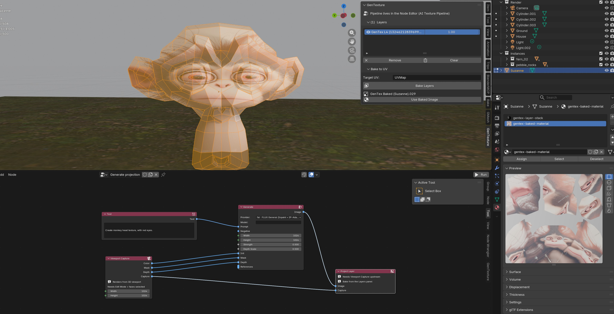
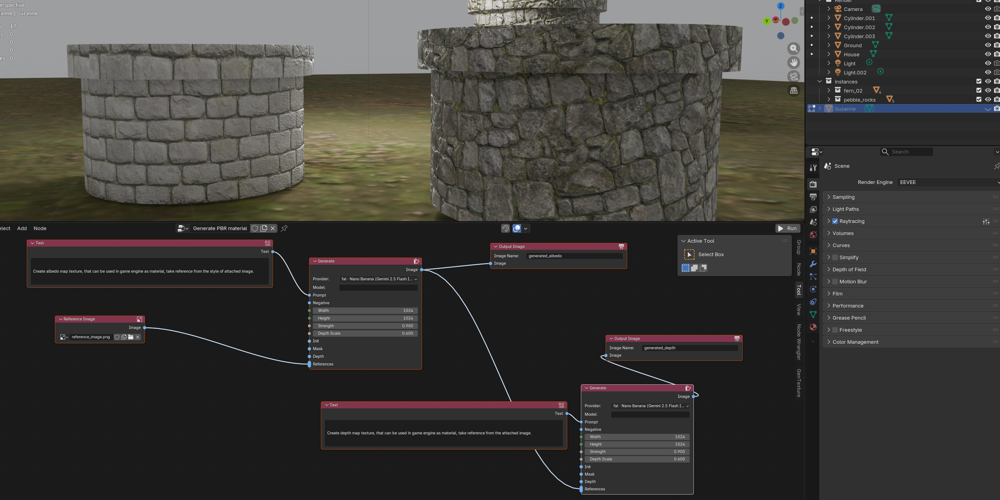

# GenTexture

A Blender addon that turns AI image-generation APIs into a node-based texture
pipeline. Wire a graph in the Node Editor; press Run; get textures back on
your meshes.





## Installation

1. Clone or copy this folder into Blender's `scripts/addons/`.
2. Edit > Preferences > Add-ons > enable "GenTexture".
3. Open the GenTexture section in preferences and fill in API keys for the
   providers you want to use.

## Getting started

The fastest way to see something work:

1. Open a Node Editor area, change its tree type (header dropdown) to
   **AI Texture Pipeline**.
2. Sidebar (N) > **GenTexture Pipeline** > **Templates** > click
   **PBR Material** or **Viewport Projection**. Templates are also under
   Shift+A > **Templates**.
3. Fill in the bits the template can't guess: drop an image into Reference
   Image (PBR template), or enter Edit Mode + face-select on a mesh
   (Viewport Projection template).
4. Pick a provider on each Generate node.
5. Click **Run** in the Node Editor header.

Status messages and errors appear in the header next to the Run button while
the graph is executing.


## Providers

| Provider | Capabilities |
|---|---|
| Stability AI | text2img, img2img, inpaint |
| fal · FLUX | text2img, img2img |
| fal · FLUX General | text2img, img2img, inpaint, depth ControlNet, IP-Adapter references |
| fal · Nano Banana | text2img with multi-image references (Google Gemini 2.5 Flash Image via fal) |
| Google · Gemini (direct) | text2img, img2img, references — calls `generativelanguage.googleapis.com` directly |
| Local · FLUX.1-dev server | text2img, img2img, inpaint, depth ControlNet, IP-Adapter — assumes a self-hosted FLUX server on localhost |

Each provider's API key + extra config lives in addon preferences. The list
is dynamic: register a new `Provider` subclass and the UI grows new fields
automatically.

## Adding a provider

See [`providers/README.md`](providers/README.md) for a step-by-step guide.
The short version: subclass `Provider`, declare `capabilities()` and
`preference_fields()`, override `text2img` / `img2img` / `inpaint`, decorate
with `@register_provider`, import in `__init__.py`.

## Layout

```
GenTexture/
  node_tree/        custom NodeTree, sockets, node classes, executor, templates
  operators/        Run/Cancel pipeline, layer-stack management, bake
  providers/        Provider plugins (Stability, fal, Gemini, local server)
  gpu/              Viewport visible/mask/depth renders, bake target
  utils/            numpy<->bpy image helpers, threading helpers, material build
  ui/               3D View sidebar panel (per-object layer stack)
  preferences.py    dynamic AddonPreferences built from provider declarations
```
